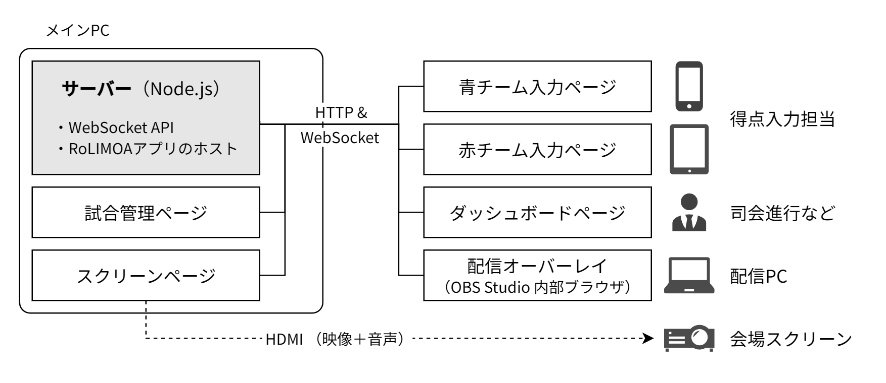
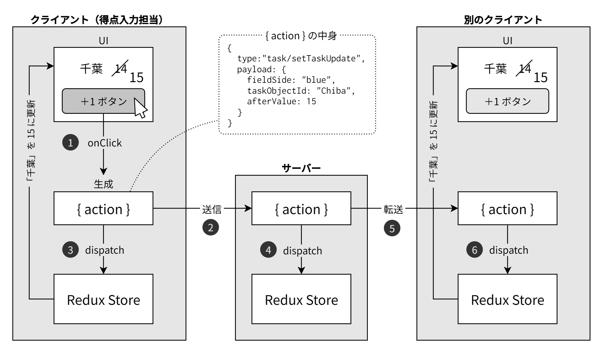

# RoLIMOA: **Ro**bocon **L**ivestreaming **I**ntegrated **M**atch **O**perating **A**pp

NHK学生ロボコンのようなロボットコンテストの大会で、青・赤チームの得点を各担当が入力し、それを会場のスクリーンやライブストリーミング（動画配信）に表示する統合的なシステムです。

[](https://www.youtube.com/watch?v=NV2unpMqg-M)

## 機能 / features



- NHK学生ロボコン・高専ロボコンと同じ、青コートと赤コートによる2チームの対戦形式
- 毎年変わるルールに合わせ、JSONで得点計算やVゴール名などを柔軟に設定
- スクリーンや配信画面に、対戦チーム名や得点、タイマーを表示
- 各デバイスでの操作した得点は、他のデバイスとリアルタイムに同期


## 使い方 / Usage

> [!NOTE]
> 詳しくは、それぞれのドキュメントを参照してください
> 
> 📖 **運用ガイド**: [docs/getting-started.md](./docs/getting-started.md) \
> 大会での使用するにあたって必要な準備やトラブルシューティングについてはこちらを参照してください
>
> 🔧 **カスタマイズ**: [docs/customization.md](./docs/customization.md) \
> 応用的なカスタマイズ実装の実例や方法についてはこちらを参照してください

### 設定ファイルの編集

競技ルールの設定は `packages/common/src/config/config.ts` で行います。特にルールに関する `rule.task_objects`, `rule.score`, `rule.vgoal` を編集します。

### 本番環境の起動

サーバ側でクライアントのビルド済みファイルをホスティングしているので、実際の大会時には次のような運用を想定しています。

```bash
# 事前にビルド
git clone https://github.com/kishimotonico/RoLIMOA.git
cd RoLIMOA
npm install
npm run build

# サーバーを起動
npm start
```

http://localhost:8000 で管理画面を開けるようになります。OSやファイアウォールを設定すれば、他のデバイスからも操作できます。


## 開発方法 / How to develop

開発サーバーを起動して、 http://localhost:5173 にアクセスしてデバッグします。

```bash
cd /path/to/RoLIMOA
npm run dev
```

### リント・フォーマット

```bash
npm run lint     # 全ワークスペースでBiome lintを実行
npm run format   # 全ワークスペースでBiome formatを実行
```

### Dockerで起動する場合 🐋

本番環境:
```bash
docker build -t rolimoa .
docker run -p 8000:8000 rolimoa
```

開発環境:
```bash
docker compose up -d
```


## アーキテクチャ / Architecture

### 技術スタック

- TypeScript
- React + MUI
- Redux Toolkit
- Recoil
- WebSocket
- Express + express-ws
- Vite (build)
- Biome (lint/format)

### モノレポ構成

- `packages/common/`: 共通型定義、Redux設定、設定ファイルスキーマ
- `packages/client/`: React フロントエンド (Vite)
- `packages/server/`: Express サーバー (WebSocket通信)

### 状態管理

- Redux Toolkit（共通）+ Recoil（クライアント固有）
- サーバー・クライアント間でReduxスライスを共有
- Reduxの更新をWebSocketでリアルタイムに同期

#### タスクオブジェクト更新時のフロー

RoLIMOAでは、複数のクライアントでリアルタイムに状態を同期するために Redux の action を送受信しています。例えば「千葉」というタスクオブジェクトが +1 されたとき、次のような動作になります。



1. **クライアント操作**: 得点入力を担当するデバイスで「+1ボタン」が押されると、クライアントはReduxのactionを生成します。actionの実態は次のようなオブジェクトです。
   ```typescript
   {
     type: "task/setTaskUpdate",
     payload: {
       fieldSide: "blue",
       taskObjectId: "Chiba", 
       afterValue: 15
     }
   }
   ```
2. **サーバーへ送信**: 生成した action をサーバーに送信します
3. **クライアントでの処理**: 操作元のクライアントは、生成した action を自身のストアに dispatch して状態を更新します。その更新がUIに反映され、千葉の値が14→15になります
4. **サーバー内での処理**: サーバーは、受け取った action を自身のストアに dispatch して状態を更新します
5. **各クライアントへ転送**: サーバーは、受信した action を他の全クライアントに転送します
6. **各クライアントでの処理**: サーバーから action を受信した各クライアントは、その action を自身のストアに dispatch して状態を更新します。その更新がUIに反映され、千葉の値が14→15になります

action は `afterValue: 15` のように更新後の値を取り扱っています。この仕様のため、同時に複数の矛盾する操作（例えば、3人が同時に千葉を -1 / +1 / +4 したとき）があった場合は後勝ちで処理されます。

### 設定システム

- `packages/common/src/config/config.ts` で競技ルール設定
- Zodスキーマ（`packages/common/src/config/schema/`）で型検証
- 多様なルールに対応するための得点の管理
    - "タスクオブジェクト" という仮想的なオブジェクトを定義
    - 得点入力画面では、各タスクオブジェクトの増減を操作
    - 得点は、タスクオブジェクト (Key-Value形式) から算出
